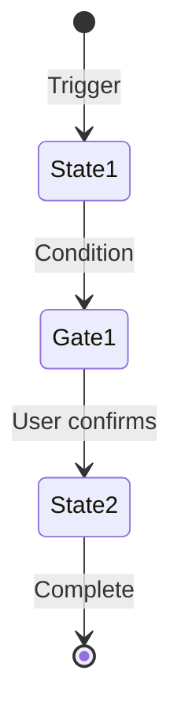
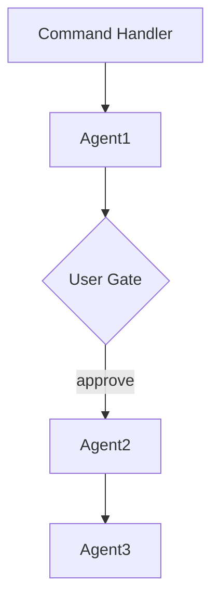
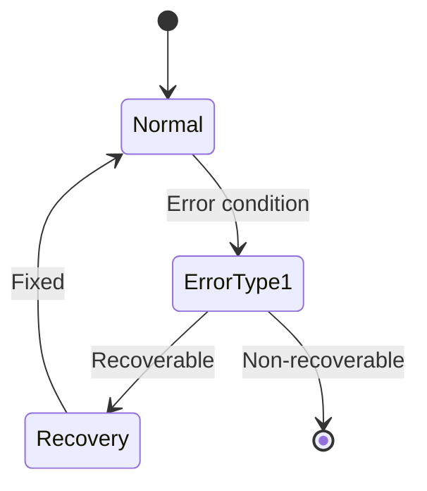

# Plugin Documentation & Testing Standards Plan

**Branch**: `feature/plugin-documentation-testing`
**Created**: 2025-12-20
**Status**: Draft

---

## Executive Summary

This plan establishes comprehensive standards for documenting and testing Claude Code plugins in the Synaptic Canvas marketplace. Based on analysis of 6 existing plugins, we introduce:

1. **SKILL-FLOW.md** - A visual documentation standard for each plugin
2. **Tiered Testing Strategy** - Agent behavior → Package-level → Smoke → Doc-driven tests
3. **CI Validation** - Automated enforcement of documentation and testing requirements

---

## Part 1: SKILL-FLOW.md Specification

### 1.1 Purpose

Every plugin MUST include a `SKILL-FLOW.md` file that provides visual and machine-parseable documentation of:

- **Entry points**: How users invoke the plugin (slash commands, flags)
- **State transitions**: How agents orchestrate workflows
- **Decision gates**: Where users provide input (fenced JSON prompts)
- **Context growth**: What information accumulates during execution
- **Error recovery**: How the system handles failures

### 1.2 Required File Structure

```
packages/<plugin-name>/
├── SKILL-FLOW.md           # NEW - Required visual documentation
├── README.md               # Quick start (link to SKILL-FLOW.md)
├── CHANGELOG.md            # Version history
├── USE-CASES.md            # Practical examples
├── TROUBLESHOOTING.md      # Error recovery
├── manifest.yaml           # Package metadata
└── ...
```

### 1.3 SKILL-FLOW.md Template

```markdown
# <Plugin Name> - Skill Flow Documentation

## Overview

[Brief description of plugin purpose and primary workflow]

**Version**: X.Y.Z
**Dependencies**: [List package and CLI dependencies]

---

## Entry Points

### Command: `/<command-name>`

**Invocation Syntax**:
```bash
/<command-name> [flags] [arguments]
```

**Flags**:

| Flag | Type | Default | Description |
|------|------|---------|-------------|
| `--flag` | type | default | Description |

**Decision Tree**:
```
[ASCII diagram of flag parsing logic]
```

---

## State Machine

### Visual Diagram (Mermaid)



### Terminal-Friendly Diagram (ASCII)

```
╔═══════════════╗
║ Entry Point   ║
╚═══════════════╝
       │
       ▼
┌─────────────┐
│  State 1    │
└─────────────┘
       │
       ▼
╔═══════════════╗
║  User Gate    ║
╚═══════════════╝
       │
       ▼
┌─────────────┐
│  State 2    │
└─────────────┘

Legend:
  ╔═══╗  User decision gate (JSON prompt)
  ┌───┐  Automated state/agent
  ←      Context added at this step
```

---

## Agent Orchestration

### Agent Call Graph



### Agent Responsibilities

| Agent | Purpose | Input Schema | Output Schema | Context Added |
|-------|---------|--------------|---------------|---------------|
| agent-1 | Description | `{...}` | `{...}` | field1, field2 |

---

## User Interaction Gates

### Gate 1: [Gate Name]

**When**: [Trigger condition]

**Prompt Structure**:
```json
{
  "type": "confirmation_gate|decision_gate",
  "gate_id": "unique_id",
  "message": "User-facing message",
  "context": { ... },
  "options": { ... }
}
```

**User Response Schema**:
```json
{
  "field": "value"
}
```

**Skip Condition**: [e.g., `--yolo` flag]

**State Transitions**:
- `response=X` → NextState
- `response=Y` → Abort

---

## Context Accumulation Map

| Stage | Agent/State | Context Snapshot | Persistence |
|-------|-------------|------------------|-------------|
| 0 | Entry | `{flags, repo}` | In-memory |
| 1 | Agent1 | `{..., new_field}` | In-memory |
| 2 | Gate1 | `{..., user_response}` | In-memory |
| N | AgentN | `{..., final_field}` | Git/API |

### Context Flow (ASCII)

```
Stage 0: Entry
  └─ {flags, repo}

Stage 1: Agent1
  └─ {flags, repo, new_field}

...
```

---

## Error Recovery Paths

### Recovery State Machine



### Error Code Reference

| Code | Severity | Recoverable | Suggested Action | Auto-Retry |
|------|----------|-------------|------------------|------------|
| `ERR.CODE` | Error/Warning | Yes/No | Action description | Yes/No |

---

## Examples

### Example 1: Happy Path

**User Input**:
```bash
/command --flag value
```

**Execution Trace**:
```
[Entry] Parsed: {flag: "value"}
     │
     ▼
[Agent1] Input: {...}, Output: {...}
     │
     ▼
[Gate1] Prompt: "...", Response: {proceed: true}
     │
     ▼
[Agent2] Input: {...}, Output: {...}
     │
     ▼
[Success] Summary: ...
```

### Example 2: Error Recovery

[Similar trace showing error handling]

---

## Configuration

[Configuration options from manifest.yaml]

---

## Related Documentation

- [README.md](README.md) - Quick start
- [USE-CASES.md](USE-CASES.md) - Practical examples
- [TROUBLESHOOTING.md](TROUBLESHOOTING.md) - Error handling

---

**Document Version**: 1.0
**Plugin Version**: X.Y.Z
**Last Updated**: YYYY-MM-DD
```

### 1.4 Diagram Standards

#### Mermaid Styling
- **User gates**: Purple fill (`fill:#f0e1ff`)
- **Agents**: Yellow fill (`fill:#fff4e1`)
- **Success states**: Green fill (`fill:#e1ffe1`)
- **Error states**: Red fill (`fill:#ffe1e1`)
- **Entry points**: Blue fill (`fill:#e1f5ff`)

#### ASCII Conventions
- `╔═══╗` - User decision gates (double lines)
- `┌───┐` - Automated states/agents (single lines)
- `←` - Context addition indicator
- `[label]` - Transition conditions

---

## Part 2: Testing Strategy

### 2.1 Priority Order

1. **Tier 1: Agent Behavior Tests** (Highest Priority)
2. **Tier 2: Package-Level Tests**
3. **Tier 3: Smoke Tests**
4. **Tier 4: Documentation-Driven Tests**

### 2.2 Tier 1: Agent Behavior Tests

**Location**: `tests/agents/`

**Purpose**: Verify agent execution paths, input/output contracts, and state transitions.

**Approach**:
```python
# tests/agents/test_agent_contracts.py

import pytest
from unittest.mock import Mock, patch

class TestAgentContracts:
    """Verify agent input/output contracts without Claude invocation."""

    @pytest.fixture
    def mock_task_tool(self):
        """Mock the Task tool for agent invocation."""
        return Mock()

    def test_intake_agent_output_schema(self, mock_task_tool):
        """Verify intake agent returns expected schema."""
        # Arrange
        mock_task_tool.return_value = {
            "success": True,
            "data": {
                "issue": {"number": 42, "title": "Test issue"}
            }
        }

        # Act
        result = invoke_agent("sc-github-issue-intake", {"issue_number": 42})

        # Assert
        assert "success" in result
        assert "data" in result
        assert "issue" in result["data"]
        assert result["data"]["issue"]["number"] == 42

    def test_agent_error_format(self, mock_task_tool):
        """Verify agent errors follow standard format."""
        mock_task_tool.return_value = {
            "success": False,
            "error": {
                "code": "GH.ISSUE.NOT_FOUND",
                "message": "Issue #999 not found",
                "recoverable": False,
                "suggested_action": "Verify issue number"
            }
        }

        result = invoke_agent("sc-github-issue-intake", {"issue_number": 999})

        assert result["success"] == False
        assert "code" in result["error"]
        assert "recoverable" in result["error"]
```

**Coverage Goals**:
- All agent input validation
- All agent output schemas
- Error response formats
- State transition triggers

### 2.3 Tier 2: Package-Level Tests

**Location**: `packages/<plugin>/tests/`

**Purpose**: Allow plugins to own their test suites, testing plugin-specific logic.

**Structure**:
```
packages/sc-github-issue/
├── tests/
│   ├── __init__.py
│   ├── conftest.py           # Package-specific fixtures
│   ├── test_workflows.py     # Workflow integration tests
│   ├── test_gates.py         # User gate schema validation
│   └── test_context.py       # Context accumulation tests
```

**Example**:
```python
# packages/sc-github-issue/tests/test_gates.py

import pytest
import json
from jsonschema import validate

class TestUserGates:
    """Validate user gate JSON schemas."""

    CONFIRMATION_GATE_SCHEMA = {
        "type": "object",
        "required": ["type", "gate_id", "message", "options"],
        "properties": {
            "type": {"enum": ["confirmation_gate", "decision_gate"]},
            "gate_id": {"type": "string"},
            "message": {"type": "string"},
            "context": {"type": "object"},
            "options": {"type": "object"}
        }
    }

    def test_fix_confirmation_gate_schema(self):
        """Verify fix confirmation gate matches schema."""
        gate = generate_fix_confirmation_gate(issue_number=42)
        validate(instance=gate, schema=self.CONFIRMATION_GATE_SCHEMA)

    def test_test_failure_gate_schema(self):
        """Verify test failure gate matches schema."""
        gate = generate_test_failure_gate(passed=10, failed=2)
        validate(instance=gate, schema=self.CONFIRMATION_GATE_SCHEMA)
```

### 2.4 Tier 3: Smoke Tests

**Location**: `scripts/smoke/`

**Purpose**: End-to-end validation of full workflows in isolated environments.

**Structure**:
```bash
#!/bin/bash
# scripts/smoke/smoke_github_issue.sh

set -euo pipefail

echo "=== Smoke Test: sc-github-issue ==="

# Setup
WORKTREE_BASE=$(mktemp -d)
TEST_REPO="test-org/test-repo"

# Test 1: List issues (read-only)
echo "[1/4] Testing --list flag..."
result=$(/sc-github-issue --list --repo "$TEST_REPO" 2>&1)
if [[ ! "$result" =~ "issues found" ]]; then
    echo "FAIL: --list did not return expected output"
    exit 1
fi
echo "PASS: --list"

# Test 2: Dry-run fix workflow
echo "[2/4] Testing --fix dry-run..."
# ... more tests

echo "=== All smoke tests passed ==="
```

**Smoke Test Matrix**:

| Plugin | Smoke Script | Tests |
|--------|--------------|-------|
| sc-github-issue | `smoke_github_issue.sh` | list, fix-dry-run, create-dry-run |
| sc-git-worktree | `smoke_git_worktree.sh` | create, scan, cleanup |
| sc-ci-automation | `smoke_ci_automation.sh` | validate, pull, build |
| sc-delay-tasks | `smoke_delay_tasks.sh` | delay-once, delay-poll |
| sc-manage | `smoke_manage.sh` | list, install, uninstall |

### 2.5 Tier 4: Documentation-Driven Tests

**Location**: `tests/doc_validation/`

**Purpose**: Generate and validate tests from SKILL-FLOW.md execution traces.

**Approach**:
```python
# tests/doc_validation/test_skill_flow.py

import pytest
import yaml
from pathlib import Path

class TestSkillFlowDocumentation:
    """Validate SKILL-FLOW.md files and their examples."""

    @pytest.fixture
    def skill_flow_files(self):
        """Find all SKILL-FLOW.md files."""
        return list(Path("packages").glob("*/SKILL-FLOW.md"))

    def test_all_packages_have_skill_flow(self, skill_flow_files):
        """Every package must have SKILL-FLOW.md."""
        packages = list(Path("packages").glob("*/manifest.yaml"))
        package_names = {p.parent.name for p in packages}

        documented = {p.parent.name for p in skill_flow_files}
        missing = package_names - documented

        assert not missing, f"Missing SKILL-FLOW.md in: {missing}"

    def test_skill_flow_has_required_sections(self, skill_flow_files):
        """SKILL-FLOW.md must have all required sections."""
        required_sections = [
            "## Overview",
            "## Entry Points",
            "## State Machine",
            "## Agent Orchestration",
            "## User Interaction Gates",
            "## Context Accumulation Map",
            "## Error Recovery Paths",
            "## Examples"
        ]

        for skill_flow in skill_flow_files:
            content = skill_flow.read_text()
            for section in required_sections:
                assert section in content, \
                    f"{skill_flow}: Missing required section '{section}'"

    def test_mermaid_diagrams_are_valid(self, skill_flow_files):
        """Mermaid diagrams should be syntactically valid."""
        # Extract and validate mermaid blocks
        pass  # Implementation using mermaid-py or similar
```

---

## Part 3: CI Validation Requirements

### 3.1 Validation Workflow

**File**: `.github/workflows/plugin-validation.yml`

```yaml
name: Plugin Validation

on:
  pull_request:
    paths:
      - 'packages/**'
      - 'tests/**'
      - '.github/workflows/plugin-validation.yml'

jobs:
  documentation:
    name: Validate Documentation
    runs-on: ubuntu-latest
    steps:
      - uses: actions/checkout@v4

      - name: Check required files
        run: |
          for pkg in packages/*/; do
            if [ -f "$pkg/manifest.yaml" ]; then
              echo "Checking $pkg..."

              # Required files
              for file in README.md SKILL-FLOW.md CHANGELOG.md; do
                if [ ! -f "$pkg/$file" ]; then
                  echo "ERROR: Missing $pkg/$file"
                  exit 1
                fi
              done

              # SKILL-FLOW.md sections
              if ! grep -q "## State Machine" "$pkg/SKILL-FLOW.md"; then
                echo "ERROR: $pkg/SKILL-FLOW.md missing 'State Machine' section"
                exit 1
              fi

              if ! grep -q "## User Interaction Gates" "$pkg/SKILL-FLOW.md"; then
                echo "ERROR: $pkg/SKILL-FLOW.md missing 'User Interaction Gates' section"
                exit 1
              fi

              if ! grep -q "## Context Accumulation Map" "$pkg/SKILL-FLOW.md"; then
                echo "ERROR: $pkg/SKILL-FLOW.md missing 'Context Accumulation Map' section"
                exit 1
              fi
            fi
          done

          echo "All documentation checks passed"

      - name: Validate Mermaid diagrams
        run: |
          npm install -g @mermaid-js/mermaid-cli

          for flow in packages/*/SKILL-FLOW.md; do
            echo "Validating Mermaid in $flow..."
            # Extract and validate mermaid blocks
            # (implementation details)
          done

  testing:
    name: Run Tests
    runs-on: ubuntu-latest
    steps:
      - uses: actions/checkout@v4

      - name: Set up Python
        uses: actions/setup-python@v5
        with:
          python-version: '3.12'

      - name: Install dependencies
        run: pip install -r requirements-dev.txt

      - name: Run agent behavior tests
        run: pytest tests/agents/ -v

      - name: Run package-level tests
        run: |
          for pkg in packages/*/tests; do
            if [ -d "$pkg" ]; then
              pytest "$pkg" -v
            fi
          done

      - name: Run doc validation tests
        run: pytest tests/doc_validation/ -v

      - name: Run smoke tests
        run: |
          for smoke in scripts/smoke/smoke_*.sh; do
            echo "Running $smoke..."
            bash "$smoke"
          done
```

### 3.2 PR Requirements

**Blocking Checks**:

| Check | Failure Condition |
|-------|-------------------|
| Documentation Structure | Missing SKILL-FLOW.md or required sections |
| Mermaid Validation | Invalid Mermaid syntax in diagrams |
| Agent Tests | Any test failure in `tests/agents/` |
| Package Tests | Any test failure in `packages/*/tests/` |
| Doc Validation | Missing sections or invalid schemas |

**Non-Blocking Warnings**:

| Check | Warning Condition |
|-------|-------------------|
| Smoke Tests | Failure (may be infrastructure-related) |
| ASCII Diagram Presence | Missing ASCII fallback diagrams |

### 3.3 Validation Script

**File**: `scripts/validate-plugin-docs.sh`

```bash
#!/bin/bash
# Validate plugin documentation structure

set -euo pipefail

PLUGIN_DIR=$1

echo "=== Validating: $PLUGIN_DIR ==="

# Required files
REQUIRED_FILES=(
    "README.md"
    "SKILL-FLOW.md"
    "CHANGELOG.md"
    "manifest.yaml"
)

for file in "${REQUIRED_FILES[@]}"; do
    if [ ! -f "$PLUGIN_DIR/$file" ]; then
        echo "ERROR: Missing required file: $file"
        exit 1
    fi
    echo "OK: $file exists"
done

# SKILL-FLOW.md required sections
SKILL_FLOW="$PLUGIN_DIR/SKILL-FLOW.md"
REQUIRED_SECTIONS=(
    "## Overview"
    "## Entry Points"
    "## State Machine"
    "## Agent Orchestration"
    "## User Interaction Gates"
    "## Context Accumulation Map"
    "## Error Recovery Paths"
    "## Examples"
)

for section in "${REQUIRED_SECTIONS[@]}"; do
    if ! grep -q "$section" "$SKILL_FLOW"; then
        echo "ERROR: SKILL-FLOW.md missing section: $section"
        exit 1
    fi
    echo "OK: $section present"
done

# Check for Mermaid diagrams
if ! grep -q '```mermaid' "$SKILL_FLOW"; then
    echo "ERROR: SKILL-FLOW.md missing Mermaid diagrams"
    exit 1
fi
echo "OK: Mermaid diagrams present"

# Check for ASCII diagrams
if ! grep -qE '(╔|┌|└|│|▼|→)' "$SKILL_FLOW"; then
    echo "WARNING: SKILL-FLOW.md may be missing ASCII fallback diagrams"
fi

# Check for JSON gate examples
if ! grep -q '"type":.*"_gate"' "$SKILL_FLOW"; then
    echo "WARNING: SKILL-FLOW.md may be missing JSON gate examples"
fi

echo "=== Validation passed: $PLUGIN_DIR ==="
```

---

## Part 4: Implementation Roadmap

### Phase 1: Foundation (Week 1-2)

- [ ] Create SKILL-FLOW.md template in `templates/`
- [ ] Create validation script `scripts/validate-plugin-docs.sh`
- [ ] Set up `tests/agents/` directory structure
- [ ] Add agent contract test fixtures

### Phase 2: Pilot (Week 3-4)

- [ ] Create SKILL-FLOW.md for `sc-github-issue` (most complex)
- [ ] Create SKILL-FLOW.md for `sc-git-worktree` (dependency)
- [ ] Add package-level tests for pilot plugins
- [ ] Validate diagrams render correctly on GitHub

### Phase 3: Rollout (Week 5-6)

- [ ] Create SKILL-FLOW.md for remaining 4 plugins
- [ ] Add package-level tests for all plugins
- [ ] Create smoke test suite
- [ ] Enable CI validation workflow

### Phase 4: Enforcement (Week 7+)

- [ ] Require SKILL-FLOW.md for all new plugins
- [ ] Block PRs failing validation
- [ ] Document contribution guidelines
- [ ] Create template generator script

---

## Part 5: Success Metrics

| Metric | Target | Measurement |
|--------|--------|-------------|
| Documentation Coverage | 100% packages with SKILL-FLOW.md | CI check |
| Mermaid Diagram Count | ≥3 per package | Automated count |
| Agent Test Coverage | ≥80% of agents | pytest coverage |
| Package Test Ownership | 100% packages with tests/ | Directory check |
| Smoke Test Pass Rate | ≥95% on main branch | CI history |
| PR Documentation Compliance | 100% (blocking) | CI enforcement |

---

## Appendix A: Existing Plugin Status

| Plugin | README | SKILL-FLOW | Tests | Status |
|--------|--------|------------|-------|--------|
| sc-git-worktree | 71 lines | ❌ Missing | Structure only | Needs SKILL-FLOW |
| sc-github-issue | 210 lines | ❌ Missing | Structure only | Needs SKILL-FLOW |
| sc-ci-automation | 166 lines | ❌ Missing | Structure only | Needs SKILL-FLOW |
| sc-delay-tasks | 68 lines | ❌ Missing | CLI tested | Needs SKILL-FLOW |
| sc-manage | 45 lines | ❌ Missing | CLI tested | Needs SKILL-FLOW |
| sc-repomix-nuget | 81 lines | ❌ Missing | Structure only | Needs SKILL-FLOW |

---

## Appendix B: Current Test Coverage Summary

| Area | Tests | Coverage |
|------|-------|----------|
| CLI Installation | 150+ | 95%+ |
| Package Structure | 100+ | 90%+ |
| Agent Behavior | 0 | 0% |
| Package-Level | 0 | 0% |
| Smoke Tests | 0 | 0% |
| **Total** | **375** | ~40% |

---

**Plan Version**: 1.0
**Author**: Claude Code + Background Agents
**Last Updated**: 2025-12-20
