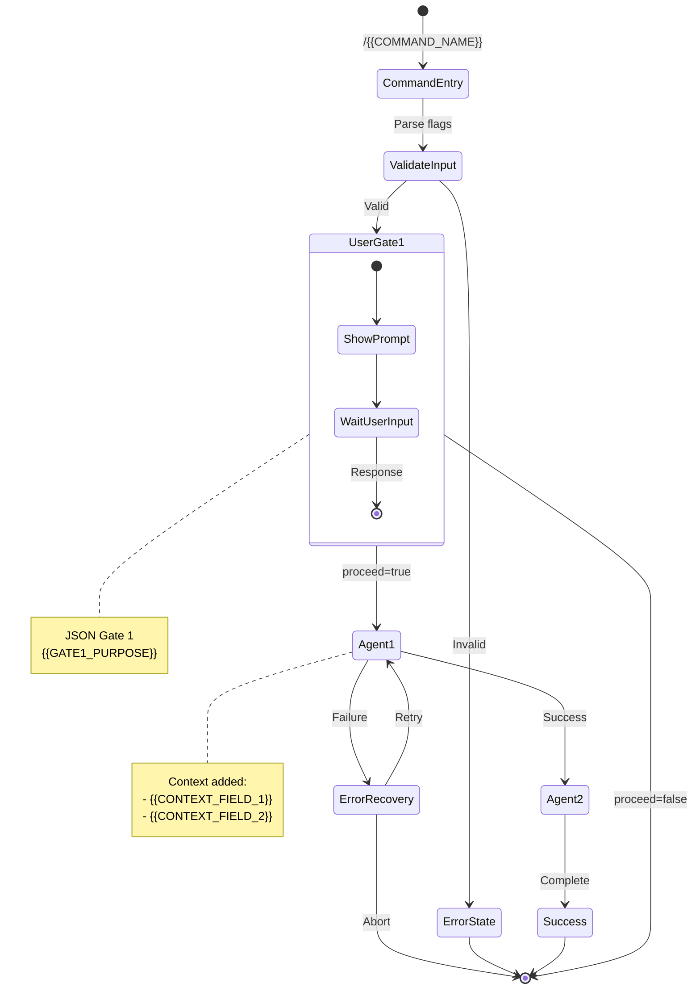
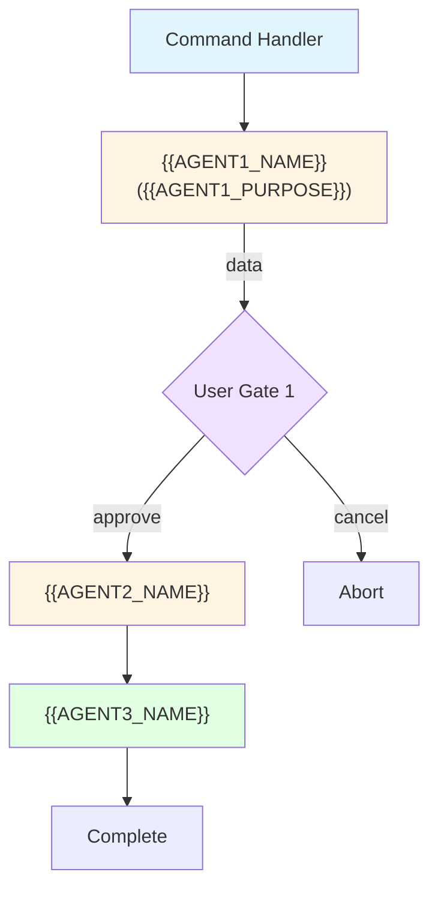

# {{PLUGIN_NAME}} - Skill Flow Documentation

## Overview

{{BRIEF_DESCRIPTION}}

**Version**: {{VERSION}}
**Dependencies**: {{DEPENDENCIES}}

---

## Entry Points

### Command: `/{{COMMAND_NAME}}`

**Invocation Syntax**:
```bash
/{{COMMAND_NAME}} [flags] [arguments]
```

**Flags**:

| Flag | Type | Default | Description |
|------|------|---------|-------------|
| `--help` | boolean | false | Show help and exit |
<!-- Add more flags -->

**Decision Tree**:
```
User input: /{{COMMAND_NAME}} [flags]
       │
       ▼
┌─────────────┐
│ Parse flags │
└─────────────┘
       │
   ┌───┴───┐
   │       │
[flag A] [flag B]
   │       │
   ▼       ▼
  ...     ...
```

---

## State Machine

### Visual Diagram (Mermaid)



### Terminal-Friendly Diagram (ASCII)

```
                      ╔═══════════════════╗
                      ║ /{{COMMAND_NAME}} ║
                      ╚═══════════════════╝
                             │
                             ▼
                      ┌─────────────┐
                      │ Parse Flags │
                      └─────────────┘
                             │
                    ┌────────┴────────┐
                    │                 │
              [valid]            [invalid]
                    │                 │
                    ▼                 ▼
            ╔═══════════════╗    ┌────────┐
            ║ User Gate 1   ║    │ Error  │
            ║ ({{PURPOSE}}) ║    └────────┘
            ╚═══════════════╝
                    │
            ┌───────┴────────┐
            │                │
        [yes]              [no]
            │                │
            ▼                │
     ┌────────────┐          │
     │  Agent 1   │ ← Context: {{CONTEXT}}
     └────────────┘          │
            │                │
         [success]           │
            │                │
            ▼                │
     ┌────────────┐          │
     │  Agent 2   │          │
     └────────────┘          │
            │                │
            ▼                │
     ┌────────────┐          │
     │  Success   │          │
     └────────────┘          │
                             │
                             ▼
                        ┌─────────┐
                        │  Abort  │
                        └─────────┘

Legend:
  ╔═══╗  User decision gate (can skip with --yolo)
  ┌───┐  Automated state/agent
  ←      Agent responsible / context added
  [xyz]  Transition condition
```

---

## Agent Orchestration

### Agent Call Graph



### Agent Responsibilities

| Agent | Purpose | Input Schema | Output Schema | Context Added |
|-------|---------|--------------|---------------|---------------|
| `{{AGENT1_NAME}}` | {{PURPOSE}} | `{field: type}` | `{success: bool, data: {...}}` | field1, field2 |
| `{{AGENT2_NAME}}` | {{PURPOSE}} | `{...}` | `{...}` | field3 |
| `{{AGENT3_NAME}}` | {{PURPOSE}} | `{...}` | `{...}` | field4 |

---

## User Interaction Gates

### Gate 1: {{GATE1_NAME}}

**When**: {{TRIGGER_CONDITION}}

**Prompt Structure**:
```json
{
  "type": "confirmation_gate",
  "gate_id": "{{GATE1_ID}}",
  "message": "{{USER_FACING_MESSAGE}}",
  "context": {
    "field1": "value1",
    "field2": "value2"
  },
  "options": {
    "proceed": "{{PROCEED_DESCRIPTION}}",
    "cancel": "{{CANCEL_DESCRIPTION}}"
  }
}
```

**User Response Schema**:
```json
{
  "proceed": true
}
```

**Skip Condition**: `--yolo` flag present

**State Transitions**:
- `proceed=true` → Agent2
- `proceed=false` → Abort

---

### Gate 2: {{GATE2_NAME}} (if applicable)

**When**: {{TRIGGER_CONDITION}}

**Prompt Structure**:
```json
{
  "type": "decision_gate",
  "gate_id": "{{GATE2_ID}}",
  "message": "{{USER_FACING_MESSAGE}}",
  "context": { ... },
  "options": {
    "option1": "{{OPTION1_DESCRIPTION}}",
    "option2": "{{OPTION2_DESCRIPTION}}",
    "option3": "{{OPTION3_DESCRIPTION}}"
  }
}
```

**User Response Schema**:
```json
{
  "action": "option1"
}
```

**Skip Condition**: {{SKIP_CONDITION}}

**State Transitions**:
- `action=option1` → NextAgent
- `action=option2` → RetryAgent
- `action=option3` → Abort

---

## Context Accumulation Map

| Stage | Agent/State | Context Snapshot | Persistence |
|-------|-------------|------------------|-------------|
| 0 | CommandEntry | `{flags: {...}, repo: "owner/repo"}` | In-memory |
| 1 | {{AGENT1_NAME}} | `{..., {{FIELD1}}: {...}}` | In-memory |
| 2 | UserGate1 | `{..., gate1_response: {...}}` | In-memory |
| 3 | {{AGENT2_NAME}} | `{..., {{FIELD2}}: {...}}` | {{PERSISTENCE}} |
| 4 | {{AGENT3_NAME}} | `{..., {{FIELD3}}: {...}}` | {{PERSISTENCE}} |

### Context Flow (ASCII)

```
Stage 0: CommandEntry
  └─ {flags, repo}

Stage 1: {{AGENT1_NAME}}
  └─ {flags, repo, {{FIELD1}}: {...}}

Stage 2: UserGate1
  └─ {flags, repo, {{FIELD1}}, gate1_response: {...}}

Stage 3: {{AGENT2_NAME}}
  └─ {..., {{FIELD2}}: {...}}

Stage 4: {{AGENT3_NAME}}
  └─ {..., {{FIELD3}}: {...}}
```

---

## Error Recovery Paths

### Recovery State Machine

```mermaid
stateDiagram-v2
    [*] --> Normal

    Normal --> {{ERROR1_CODE}} : {{ERROR1_CONDITION}}
    Normal --> {{ERROR2_CODE}} : {{ERROR2_CONDITION}}
    Normal --> Success

    {{ERROR1_CODE}} --> Recovery1 : Recoverable
    {{ERROR1_CODE}} --> [*] : Non-recoverable

    Recovery1 --> Normal : Fixed

    {{ERROR2_CODE}} --> UserDecision : Prompt user
    UserDecision --> Normal : Proceed
    UserDecision --> Retry : Retry
    UserDecision --> [*] : Abort

    Retry --> Normal

    Success --> [*]
```

### Error Code Reference

| Code | Severity | Recoverable | Suggested Action | Auto-Retry |
|------|----------|-------------|------------------|------------|
| `{{ERROR1_CODE}}` | Error | Yes/No | {{SUGGESTED_ACTION}} | Yes/No |
| `{{ERROR2_CODE}}` | Warning | Yes | {{SUGGESTED_ACTION}} | No |
| `{{ERROR3_CODE}}` | Error | No | {{SUGGESTED_ACTION}} | No |

---

## Examples

### Example 1: Happy Path

**User Input**:
```bash
/{{COMMAND_NAME}} {{FLAGS}}
```

**Execution Trace**:
```
[CommandEntry] Parsed: {flags}
     │
     ▼
[Agent: {{AGENT1_NAME}}]
  Input: {...}
  Output: {success: true, data: {...}}
     │
     ▼
[Gate 1: {{GATE1_NAME}}]
  Prompt: "{{MESSAGE}}"
  User Response: {proceed: true}
     │
     ▼
[Agent: {{AGENT2_NAME}}]
  Input: {...}
  Output: {success: true, data: {...}}
     │
     ▼
[Agent: {{AGENT3_NAME}}]
  Input: {...}
  Output: {success: true, data: {...}}
     │
     ▼
[Success]
  Summary:
    {{FIELD1}}: {{VALUE}}
    {{FIELD2}}: {{VALUE}}
    {{FIELD3}}: {{VALUE}}
```

### Example 2: Error Recovery

**User Input**:
```bash
/{{COMMAND_NAME}} {{FLAGS}}
```

**Execution Trace**:
```
[CommandEntry] Parsed: {flags}
     │
     ▼
[Agent: {{AGENT1_NAME}}]
  ERROR: {{ERROR_CODE}} - {{ERROR_MESSAGE}}
     │
     ▼
[Error Recovery]
  Suggested action: {{ACTION}}
  User action: {{USER_CHOICE}}
     │
     ▼
[Agent: {{AGENT1_NAME}}] (retry)
  Output: {success: true, data: {...}}
     │
     ▼
... (continues to success)
```

### Example 3: YOLO Mode (if applicable)

**User Input**:
```bash
/{{COMMAND_NAME}} {{FLAGS}} --yolo
```

**Execution Trace**:
```
[CommandEntry] Parsed: {flags, yolo: true}
     │
     ▼
[Agent: {{AGENT1_NAME}}]
  Output: {...}
     │
     ▼
[Gate 1] SKIPPED (--yolo)
     │
     ▼
[Agent: {{AGENT2_NAME}}]
  Output: {...}
     │
     ▼
... (no user interaction required)
```

---

## Configuration

Configuration options from `manifest.yaml`:

```yaml
options:
  {{OPTION1_NAME}}:
    type: string
    default: "{{DEFAULT_VALUE}}"
    description: "{{DESCRIPTION}}"
  {{OPTION2_NAME}}:
    type: boolean
    default: true
    description: "{{DESCRIPTION}}"
```

Or from `.claude/config.yaml`:

```yaml
{{PLUGIN_NAME}}:
  {{OPTION1_NAME}}: "{{VALUE}}"
  {{OPTION2_NAME}}: true
```

---

## Related Documentation

- [README.md](README.md) - Quick start and installation
- [USE-CASES.md](USE-CASES.md) - Practical usage examples
- [TROUBLESHOOTING.md](TROUBLESHOOTING.md) - Error handling guide
- [CHANGELOG.md](CHANGELOG.md) - Version history

---

**Document Version**: 1.0
**Plugin Version**: {{VERSION}}
**Last Updated**: {{DATE}}
